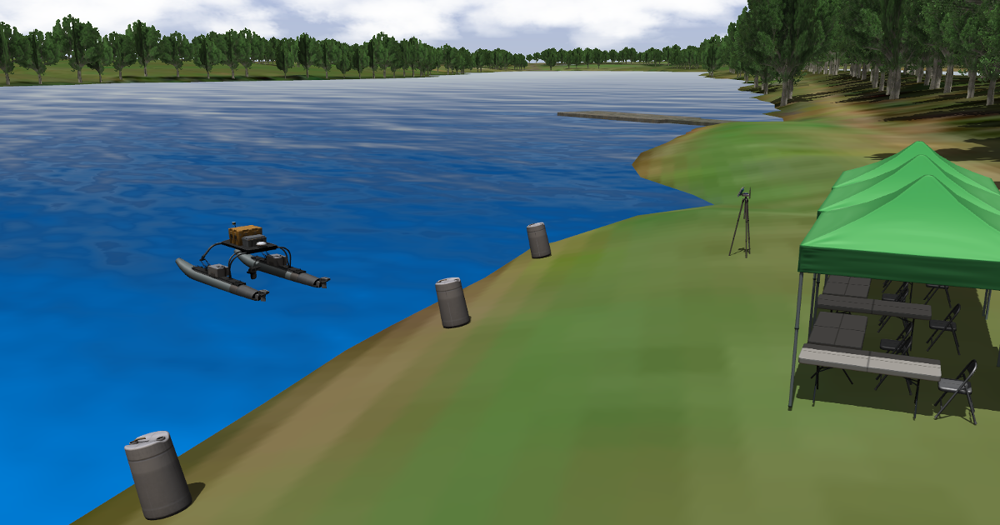

# vrx-hydrone

## Dependencies
Install [ROS 1 Noetic](https://wiki.ros.org/noetic/Installation/Ubuntu) 
```
sudo apt update
```

```
sudo apt install -y build-essential cmake cppcheck curl git gnupg libeigen3-dev libgles2-mesa-dev lsb-release pkg-config protobuf-compiler qtbase5-dev python3-dbg python3-pip python3-venv ruby software-properties-common wget 
sudo sh -c 'echo "deb http://packages.ros.org/ros/ubuntu $(lsb_release -sc) main" > /etc/apt/sources.list.d/ros-latest.list'
sudo apt-key adv --keyserver 'hkp://keyserver.ubuntu.com:80' --recv-key C1CF6E31E6BADE8868B172B4F42ED6FBAB17C654
sudo sh -c 'echo "deb http://packages.osrfoundation.org/gazebo/ubuntu-stable `lsb_release -cs` main" > /etc/apt/sources.list.d/gazebo-stable.list'
wget http://packages.osrfoundation.org/gazebo.key -O - | sudo apt-key add -
sudo apt update
DIST=noetic
GAZ=gazebo11
sudo apt install ${GAZ} lib${GAZ}-dev ros-${DIST}-gazebo-plugins ros-${DIST}-gazebo-ros ros-${DIST}-hector-gazebo-plugins ros-${DIST}-joy ros-${DIST}-joy-teleop ros-${DIST}-key-teleop ros-${DIST}-robot-localization ros-${DIST}-robot-state-publisher ros-${DIST}-joint-state-publisher ros-${DIST}-rviz ros-${DIST}-ros-base ros-${DIST}-teleop-tools ros-${DIST}-teleop-twist-keyboard ros-${DIST}-velodyne-simulator ros-${DIST}-xacro ros-${DIST}-rqt ros-${DIST}-rqt-common-plugins
sudo apt install ros-noetic-geographic-msgs
```

## Create your Workspace and Get the Source Code
### Set up your workspace in the home directory of your host:
```
mkdir -p ~/vrx_hy_ws/src
cd ~/vrx_hy_ws/src
```
### Clone the hydrone-vrx source repository:
```
git clone https://github.com/hydrone-furg/vrx-hydrone -b noetic-dev
```
```
chmod +x ~/vrx_hy_ws/src/vrx-hydrone/vrx_gazebo/scripts/generate_avoid_obstacles_buoys.py
```

## Build and Run the VRX Simulation Platform
### Step 1: Build
```
source /opt/ros/noetic/setup.bash
```
```
cd ~/vrx_hy_ws
catkin_make
```

### Step 2: Run
```
source  ~/vrx_hy_ws/devel/setup.bash
roslaunch vrx_gazebo vrx.launch
```

For more information, read:
[vrx_classic_tutorials](https://github.com/osrf/vrx/wiki/vrx_classic_api_tutorials)

# Virtual RobotX (VRX)
This repository is the home to the source code and software documentation for the VRX simulation environment, which supports simulation of unmanned surface vehicles in marine environments.
* Designed in coordination with RobotX organizers, this project provides arenas and tasks similar to those featured in past and future RobotX competitions, as well as a description of the WAM-V platform.
* For RobotX competitors this simulation environment is intended as a first step toward developing tools prototyping solutions in advance of physical on-water testing.
* We also welcome users with simulation needs beyond RobotX. As we continue to improve the environment, we hope to offer support to a wide range of potential applications.

## Coming Soon: Gazebo Sim Port
We're happy to announce VRX will soon be switching over from Gazebo Classic to the newer Gazebo simulator (formerly [Ignition Gazebo](https://www.openrobotics.org/blog/2022/4/6/a-new-era-for-gazebo)). Please see the [VRX Gazebosim Port Wiki page](https://github.com/osrf/vrx/wiki/VRX-Gazebosim-Port) for key details.

## The VRX Competition
The VRX environment is also the "virtual venue" for the [VRX Competition](https://github.com/osrf/vrx/wiki). Please see our Wiki for tutorials and links to registration and documentation relevant to the virtual competition. 




## Getting Started

 * Watch the [Release 1.5 Highlight Video](https://youtu.be/-2BP2P3CHYw)
 * The [VRX Wiki](https://github.com/osrf/vrx/wiki) provides documentation and tutorials.
 * The instructions assume a basic familiarity with the ROS environment and Gazebo.  If these tools are new to you, we recommend starting with the excellent [ROS Tutorials](http://wiki.ros.org/ROS/Tutorials)
 * For technical problems, please use the [project issue tracker](https://github.com/osrf/vrx/issues) to describe your problem or request support. 

## Reference

If you use the VRX simulation in your work, please cite our summary publication, [Toward Maritime Robotic Simulation in Gazebo](https://wiki.nps.edu/display/BB/Publications?preview=/1173263776/1173263778/PID6131719.pdf): 

```
@InProceedings{bingham19toward,
  Title                    = {Toward Maritime Robotic Simulation in Gazebo},
  Author                   = {Brian Bingham and Carlos Aguero and Michael McCarrin and Joseph Klamo and Joshua Malia and Kevin Allen and Tyler Lum and Marshall Rawson and Rumman Waqar},
  Booktitle                = {Proceedings of MTS/IEEE OCEANS Conference},
  Year                     = {2019},
  Address                  = {Seattle, WA},
  Month                    = {October}
}
```

## Contributing
This project is under active development to support the VRX and RobotX teams. We are adding and improving things all the time. Our primary focus is to provide the fundamental aspects of the robot and environment, but we rely on the community to develop additional functionality around their particular use cases.

If you have any questions about these topics, or would like to work on other aspects, please contribute.  You can contact us directly (see below), submit an [issue](https://github.com/osrf/vrx/issues) or, better yet, submit a [pull request](https://github.com/osrf/vrx/pulls/)!

## Contributors

We continue to receive important improvements from the community.  We have done our best to document this on our [Contributors Wiki](https://github.com/osrf/vrx/wiki/Contributors).

## Contacts

 * Carlos Aguero <caguero@openrobotics.org>
 * Michael McCarrin <mrmccarr@nps.edu>
 * Brian Bingham <bbingham@nps.edu>
